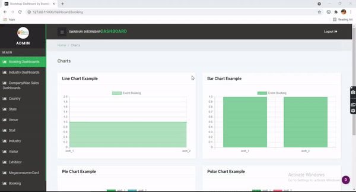
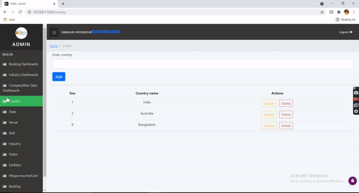
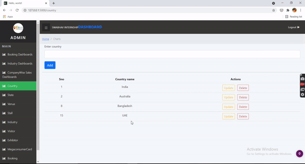

<h1 align="center">Database Management System</h1>
  

<b>Tools</b>

 

|    | Technologies used                                                                                                                                                      |
|----|------------------------------------------------------------------------------------------------------------------------------------------------------------------------|
| 1. | HTML , CSS , Javascript , JS for frontend.                                                                                                                             |
| 2. | Heidi SQL for storing data.                                                                                                                                            |
| 3. | Flask and python for deployment.                                                                                                                                       |

   
  

<b>Video Demonstration</b>

 
<h4 align="center">Dashboard</h6>
 </img>  
Adding new data and reflecting the same on Database. 
</img>  
Updating the existing data and reflecting the same on Database.
</img>
Deleting the data and reflecting the same on Database.
</img>

      

<b>Things Achieved During The Project  </b>

 

|    | Things Achieved During The Project                                                                                                                                     |
|----|------------------------------------------------------------------------------------------------------------------------------------------------------------------------|
| 1. | Guided by Devbrat Dash and Maulik Tanna.                                                                                                                               |
| 2. | Mobile-first was used while designing the website.                                                                                                                     |
| 3. | The website was designed using HTML5, CSS3, Javascript, Anime.js which are the core tools for building the frontend of the website.                                    |
| 4. | Smtp.js was used for the contact form to send an email directly from Javascript to the owner of the website sending the details given by the user in the contact form. |
| 5. | Website was animated using CSS3 and Anime.js.                                                                                                                          |
| 6  | We have used polyfills from polyfill.io for cross-browser compatibility.                                                                                               |
| 7. | Search Engine Optimization(SEO) was done for the website.                                                                                                              |
| 8. | Website was tested using Browser Stack.                                                                                                                                |
| 9. | Website :- https://testwebsitedev.netlify.app/                                                                                                                         |                                                                                                                       |

 

  
  

